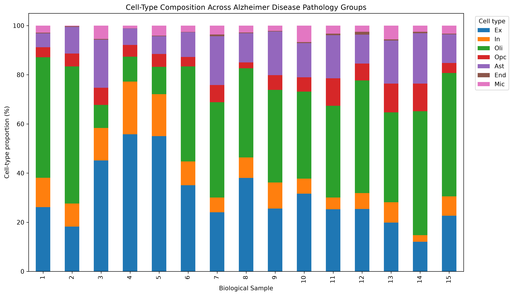
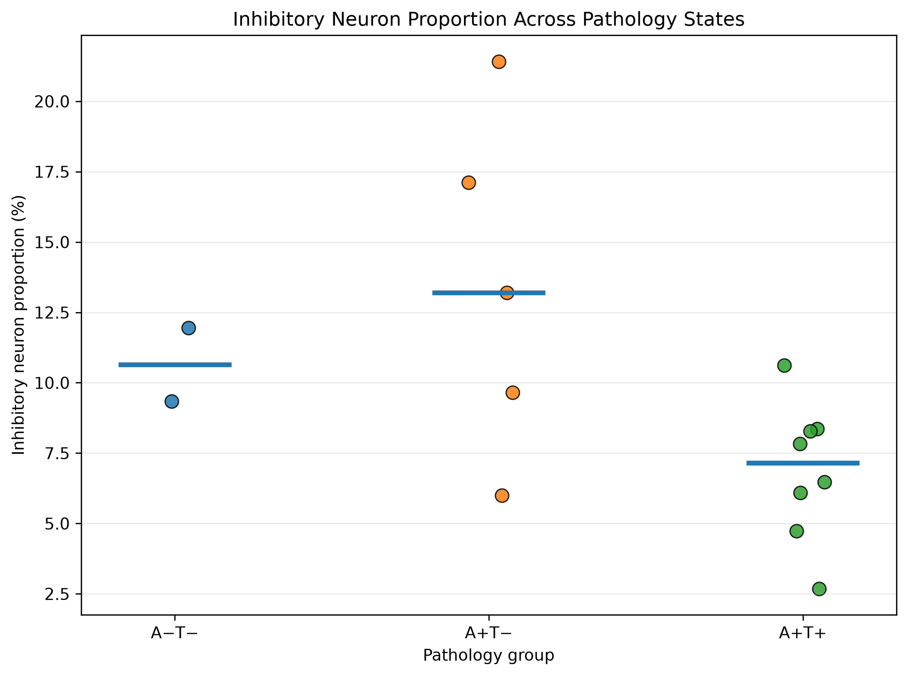
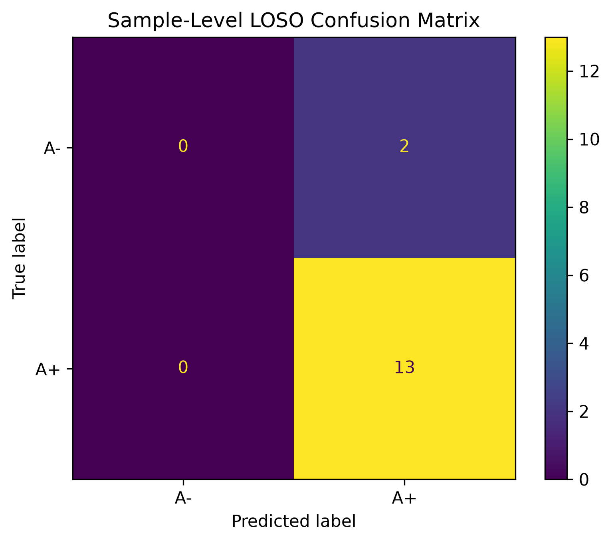

# Alzheimer-Single-Cell-ML

Independent computational analysis of Alzheimer's disease using single-nucleus RNA-seq data, cell-type composition analysis, and sample-level machine learning.

## Project Overview

This project investigates how cell-type composition and transcriptomic patterns vary across Alzheimer's disease pathology states using publicly available single-nucleus RNA-seq data.

The analysis combines single-cell analysis with machine learning while emphasizing **biological-sample-level validation** to avoid information leakage between training and test data.

The main research question is:

> **How do cell-type composition and transcriptomic patterns vary across amyloid/tau pathology states in Alzheimer's disease, and do these patterns generalize across biological samples?**

## Dataset

Single-nucleus RNA-seq data were obtained from the NCBI Gene Expression Omnibus (GEO):

**GSE243292**

The dataset contains:

* 122,606 cells
* 26,423 genes
* 15 biological samples
* Cell-type annotations and amyloid/tau pathology information

Pathology groups include:

* A−T−
* A+T−
* A+T+

## Single-Cell RNA-seq Analysis

The single-cell workflow includes:

* Quality control and filtering
* Normalization and log transformation
* Highly variable gene selection
* PCA and UMAP dimensionality reduction
* Cell-type-specific expression analysis
* APOE and TREM2 expression analysis
* Sample-level cell-type composition analysis
* Pathology-associated analysis of cell-type proportions

### Cell-Type Composition

Cell-type proportions were calculated separately for each biological sample and correlated with ordinal pathology state.

Inhibitory neuron abundance showed the strongest exploratory association with pathology:

* Spearman rho = **−0.584**
* Unadjusted p = **0.022**
* FDR = **0.155**

Because the association did not remain significant after multiple-testing correction, it is treated as an **exploratory finding rather than a validated biomarker**.

An additional comparison found lower inhibitory-neuron proportions in A+T+ samples than A+T− samples, but this result is also considered exploratory because of the limited number of biological samples and the broader multiple-testing context.

## Machine Learning Analysis

An initial cell-level logistic regression analysis produced approximately 70% accuracy. However, randomly splitting individual cells allows cells from the same biological sample to appear in both training and testing sets, creating potential information leakage.

The analysis was therefore redesigned using **leave-one-sample-out (LOSO) validation**, treating each biological sample as the independent unit of observation.

For each held-out sample:

1. Expression values were aggregated across the sample.
2. Standardization was performed using training samples only.
3. PCA was fit using training samples only.
4. Logistic regression was trained on the remaining samples.
5. The held-out biological sample was predicted.

### Sample-Level Validation Results

For three-class pathology classification:

* Accuracy: **46.7%**
* Balanced accuracy: **36.7%**
* Macro F1: **34.4%**

For binary A+ vs A− classification:

* Accuracy: **86.7%**
* Majority-class baseline: **86.7%**
* Balanced accuracy: **50.0%**
* Macro F1: **46.4%**

Both A− samples were classified as A+, indicating that the model did not demonstrate meaningful predictive signal for the A− group under sample-level validation.

These results demonstrate why biological-sample-level validation is important for single-cell machine learning studies and show that apparent cell-level predictive performance may not generalize across independent samples.

## Tools

### Single-Cell Analysis

* Python
* Scanpy
* AnnData
* Pandas
* NumPy
* SciPy
* Matplotlib

### Machine Learning

* Python
* scikit-learn
* Pandas
* Scanpy
* AnnData
* Joblib

## Repository Structure

```text
Alzheimer-Single-Cell-ML/
├── Machine_Learning/
├── Single_Cell_RNAseq/
├── Analysis/
│   ├── single_sample_validation.py
│   ├── single_cell_composition.py
│   ├── sample_level_LOSO_predictions.csv
│   ├── sample_level_LOSO_metrics.csv
│   ├── sample_cell_type_composition.csv
│   ├── cell_type_pathology_correlations.csv
│   └── inhibitory_neuron_pathology.png
├── README.md
└── project_conclusions.md
```

## Research Conclusions

The analysis revealed substantial heterogeneity in cell-type composition across Alzheimer's pathology states.

Inhibitory-neuron abundance showed the strongest exploratory cell-type association with pathology, but this finding did not remain statistically significant after multiple-testing correction.

Sample-level machine-learning models showed limited generalization across biological samples, demonstrating the importance of avoiding information leakage when analyzing single-cell data.

Overall, the project emphasizes **biologically rigorous validation rather than optimizing for a high predictive accuracy value**.

## Reproducibility

Install the required Python packages with:

```bash
pip install -r requirements.txt
```

Run the sample-level machine-learning analysis with:

```bash
python Analysis/single_sample_validation.py --data "PATH_TO_GSE243292_ADsnRNAseq_GEO_data.h5ad"
```

Run the cell-type composition analysis with:

```bash
python Analysis/single_cell_composition.py --data "PATH_TO_GSE243292_ADsnRNAseq_GEO_data.h5ad"
```

The scripts generate the corresponding result files in the `Analysis/` directory.


## Key Results

### Cell-Type Composition

Sample-level cell-type composition varied substantially across Alzheimer's pathology groups, demonstrating heterogeneity across biological samples.



### Inhibitory Neuron Association

Inhibitory-neuron abundance showed the strongest exploratory association with ordinal pathology state (Spearman rho = ?0.584, unadjusted p = 0.022), but the association did not remain significant after multiple-testing correction.



### Sample-Level Machine Learning

Leave-one-sample-out validation showed limited generalization across biological samples. Both A? samples were classified as A+, despite an overall accuracy of 86.7%, which matched the majority-class baseline.



## Author

**Siddharth Vivek**
